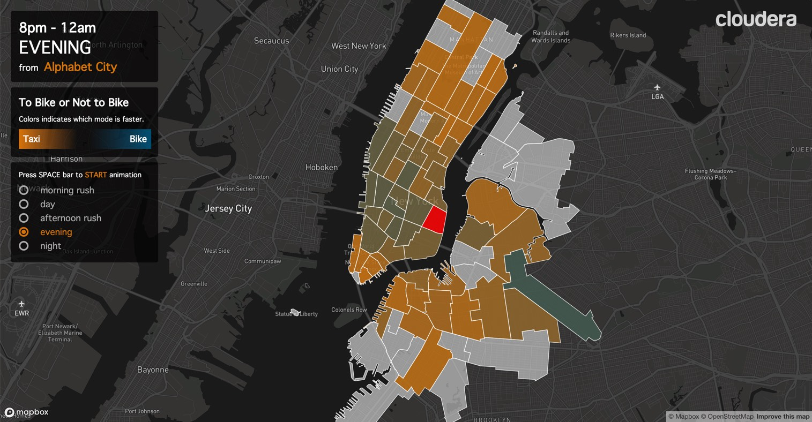

## Cloudera SKO Demo UI

Code for the demo application built to showcase CDSW capabilities.
The demo is built using Geo spatial data (Taxi Cab, and CitiBike).

### Data Analysis Steps [Performed in CDSW]

- Data cleaning (aggregating timestamps, aggregating bike data into known taxizones, deleting taxizones with little data, removing trips on weekends, removing leisure bike rides, etc).
- Monte Carlo Simulation to generate a likelihood on how much faster a given trip is for `bike` vs `taxi` transport modes.
- Export results of monte carlo similulation as json files used for the demo interface.

### Use Case/Story

- Shows how data can be ingested and analyzed in CSDW.
- Monte Carlo Simulations used to generate estimates that help answer the question: `For a given route, which mode of transport is better?`
- Businesses can use the interactive visualizations for decision making around transit related problems. E.g Trader joes may use this in decisions on how to distribute goods across stores and customers.

### Presentation
- **Monte Carlo results**: The initial visualization shows new york city segmented into taxi zones. For each zone the color chart shows which transport mode is faster from a  reference zone (in red). The demonstrator can either click on each zone to explore new relationships or press **SPACEBAR** to  run an animated loop.
 
- **Outlier Prediction Model** Demonstrator can Press T to launch this animation. Animation replays trips between Trader Joe store locations and queries a model served via CDSW which classifiers each trip as an outlier or not. Outliers are visualized using red tracks, while normal trips are visualized in blue (bike) and yellow (taxi).


### Demo Interface



- Web app served over flask
- Supports interactive querying (where are bikes faster and at what point in the day?)
- Supports and animation reel that cycles through data and visualizes predictions as over time periods during the day for each taxi zone.


## Model

Model to classify a trip as outlier has been built and served on the `/model` endpoint on cdsw.   


## Running App.

Import the application repo to CDSW, navigate to the `app` directory, launch the following.

```shell
cd sko20-demo/app
python app.py    // for csdw run cdsw_app.py
```

## TODO
- App is currently optimized for a knowledgeable presenter. More work is planned for an improved user experience for an individual new user (more documentation, cues and interaction scaffolds).